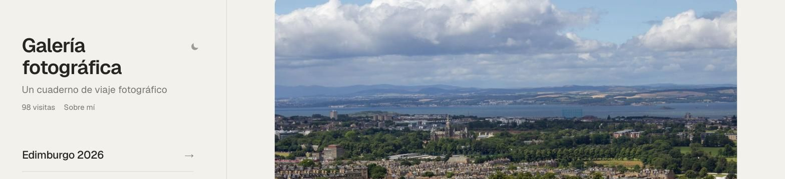
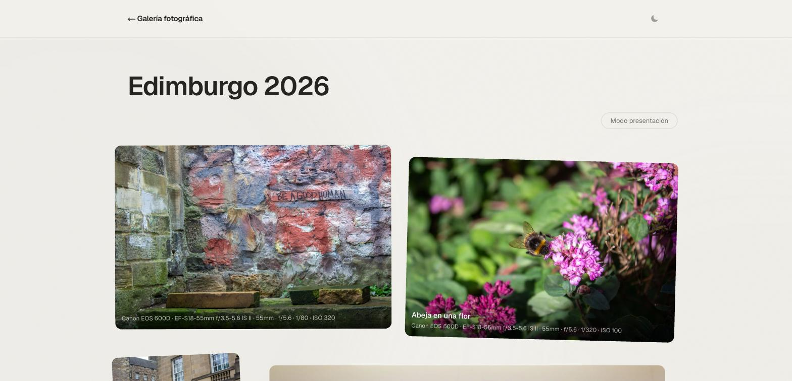
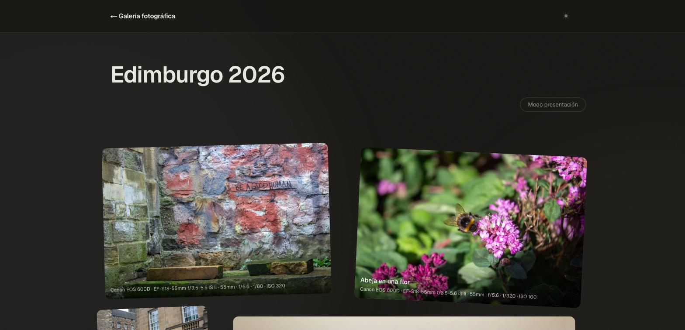
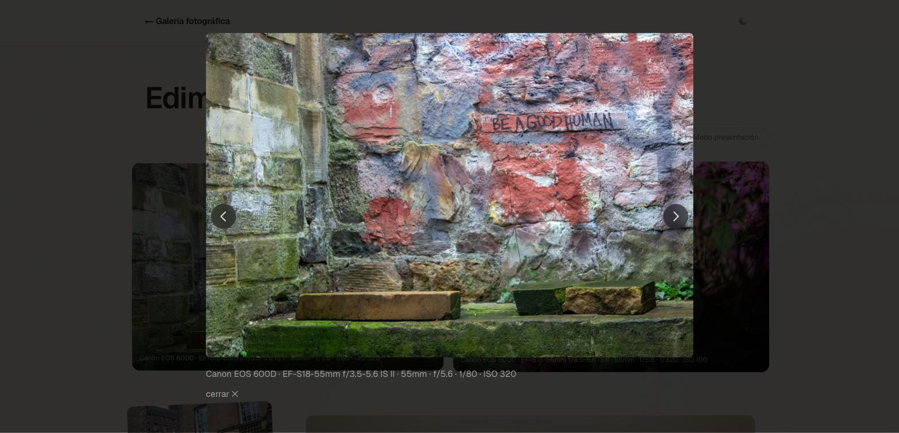
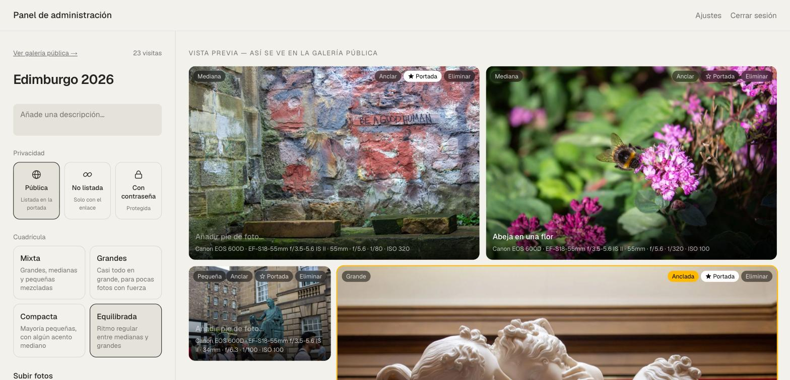
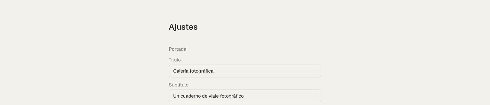
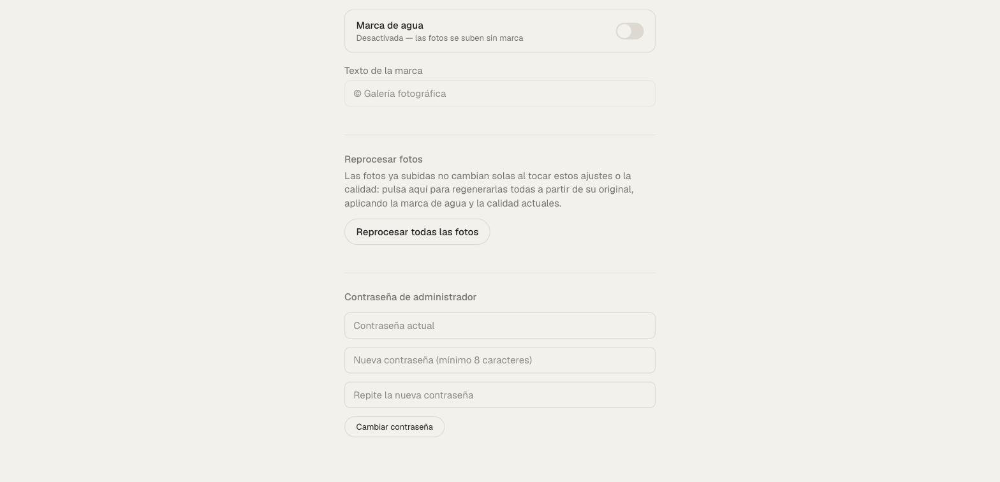

# PhotoPortfolio · Virtual Gallery

A minimalist, self-hosted photo gallery for showcasing personal photography by
trip or theme — built as a "museum walkthrough": scroll through a gallery and
let the photos do the talking, with real EXIF data, watermark protection, and
three privacy levels per gallery.

This is a portfolio/demo build. The screenshots and example content below use
generic placeholder text and a single non-identifying travel gallery — no
personal information is included.

## Screenshots

**Home page** — editable title/subtitle, public visit count, a slowly
scrolling rail of featured photos, and the gallery list.



**Gallery view** — a deterministic masonry mosaic (large/medium/small slots
per a chosen template), captions, and real EXIF specs per photo.



**Dark mode** — every page adapts, remembered per browser.



**Photo viewer** — opens a photo full-size with previous/next navigation
(arrows, keyboard, swipe).



**Admin editor** — drag photos to reorder (or pin one in place), pick a
privacy level and a grid template, mark up to 3 photos to feature on the
home page. The preview mirrors the public page exactly.



**Settings** — editable site title/subtitle, an on/off watermark with custom
text, a one-click reprocess for already-uploaded photos, and changing the
admin password.




## Features

- **Galleries with three privacy levels**: public (listed on the home page),
  unlisted (reachable only by direct link), or password-protected
  (bcrypt-hashed, session unlocked per gallery for 7 days).
- **Deterministic masonry layout** — four selectable grid templates (mixed,
  large, compact, balanced) that render identically in the admin preview and
  the public page, computed client-side by real photo aspect ratio. Photos
  are never cropped, anywhere.
- **Photo viewer** with previous/next navigation via on-screen arrows,
  keyboard (← →, Esc), and touch swipe; a CSS-only "expanded" view for
  mobile that doesn't block pinch-to-zoom (unlike the native Fullscreen API).
- **Presentation mode** — a fullscreen, auto-advancing slideshow for a
  gallery (desktop only).
- **Drag-and-drop photo reordering**, including a "pin" that locks a photo to
  a fixed position even if others around it are deleted or reordered.
- **Home page featured rail** — up to 3 photos per gallery can be marked to
  appear in a slowly scrolling rail on the home page (vertical on desktop,
  horizontal on mobile). Draggable by hand (touch) or by mouse wheel (PC);
  resumes auto-scroll after you let go.
- **Drag-and-drop gallery reordering** on the home page, from the admin
  dashboard.
- **EXIF extraction on upload** (camera, lens, aperture, shutter speed, ISO,
  focal length, GPS, capture date) shown as a caption line per photo.
- **Server-side watermarking** (configurable on/off and custom text) baked
  into every served image — originals are never exposed. A one-click
  "reprocess all photos" applies new watermark/quality settings retroactively.
- **Duplicate-upload protection** via a SHA-256 content hash per gallery.
- **First-run admin setup** — no password baked into an environment variable;
  the first visit to `/admin` prompts you to create one, hashed with bcrypt.
- **Session auth without a third-party library** — HMAC-SHA256 signed,
  httpOnly cookies via the Web Crypto API, for both the admin session and
  per-gallery password unlocks.
- **Responsive**, including a mobile-specific home page layout and a
  touch-friendly admin (auto-scroll while dragging near the screen edge).

## Tech stack

- [Next.js 16](https://nextjs.org) (App Router, Turbopack, Server Actions)
- [React 19](https://react.dev)
- [Prisma 7](https://www.prisma.io) + SQLite (via `better-sqlite3` driver
  adapter)
- [Tailwind CSS 4](https://tailwindcss.com)
- [Framer Motion](https://www.framer.com/motion/) for scroll-reveal animation
- [sharp](https://sharp.pixelplumbing.com) for resizing/watermarking
- [exifr](https://github.com/MikeKovarik/exifr) for EXIF/GPS extraction
- [bcryptjs](https://github.com/dcodeIO/bcrypt.js) for password hashing

No auth library, no image CDN, no external services — it's designed to be
self-hosted on a single small machine (a homelab box, a Raspberry Pi, a
cheap VPS) with photos stored on local disk.

## Getting started

```bash
npm install
cp .env.example .env
```

Edit `.env`:

- `DATABASE_URL` — defaults to a local SQLite file, fine as-is.
- `SESSION_SECRET` — generate one with:
  `node -e "console.log(require('crypto').randomBytes(32).toString('base64url'))"`
- `ALLOWED_DEV_ORIGIN` — optional, only needed to open the dev server from
  another device on your local network (e.g. testing on your phone).

Set up the database:

```bash
npx prisma migrate deploy
npx prisma generate
```

Run it:

```bash
npm run dev
```

Open `http://localhost:3000/admin` — the first visit prompts you to create
the admin password. From there, create a gallery and upload photos.

## Project structure

```
src/
  app/
    page.tsx                 Home page (title/subtitle, featured rail, gallery list)
    galeria/[slug]/           Public gallery page + password unlock
    sobre-mi/                 "About me" page
    admin/                     Admin dashboard, gallery editor, settings, first-run setup
    api/img/                   Watermarked image serving (display/thumb variants)
  components/                 GalleryView, MasonryGrid, FeaturedRail, PresentationMode, admin editors…
  lib/                        Session signing, gallery access, EXIF, watermarking, photo ordering…
prisma/
  schema.prisma               Gallery, Photo, Settings models
  migrations/                 Hand-written, reviewed SQL migrations
```

## License

Personal/portfolio project, shared as-is for reference. No license file is
included — ask before reusing substantial parts commercially.
